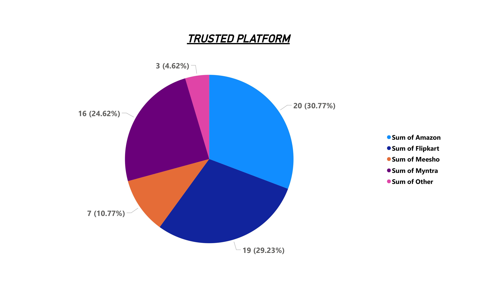
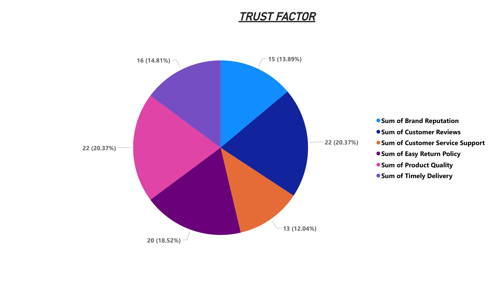
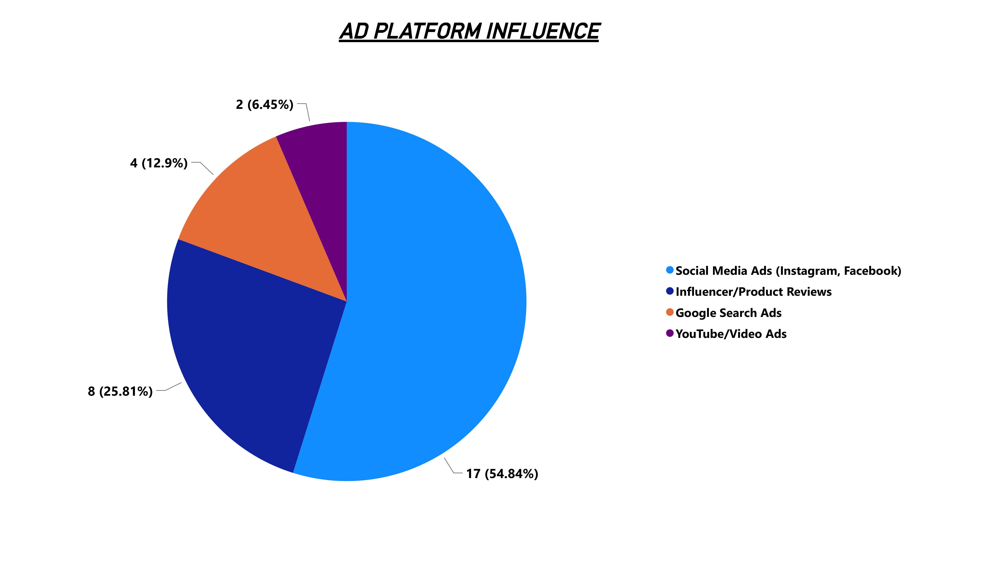
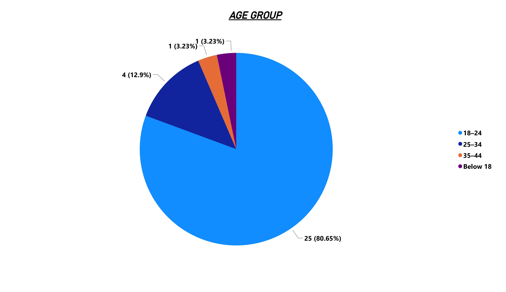
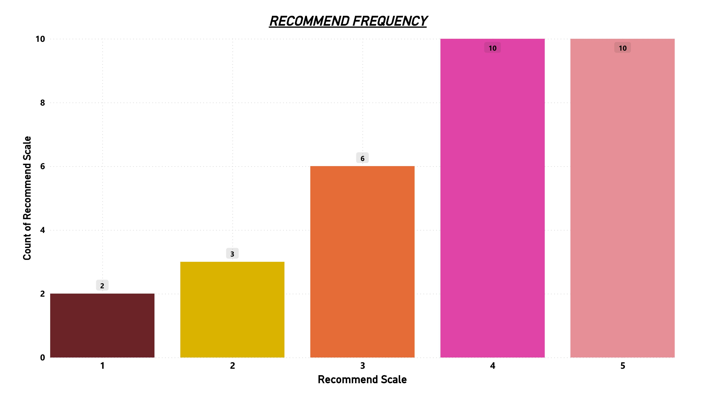

# Online Shopping Behavior Survey Analysis

## Executive Summary

This project presents a survey-based data analysis focused on understanding online shopping behavior, advertisement influence, and platform trust among consumers. Data was collected using a structured Google Form consisting of 11 questions and analyzed using Power BI to uncover patterns, preferences, and trust factors influencing e-commerce purchasing decisions.

The analysis indicates that consumers aged 18–34 are the most active online shoppers, with customer reviews and product quality being the primary drivers of trust. Social media and personalized advertisements significantly influence purchasing behavior, while advertisements that clearly demonstrate product usage and authentic influencer collaborations are more effective than celebrity endorsements.

Based on these findings, this project recommends adopting youth-focused marketing strategies, strengthening customer review visibility, investing in social media and targeted advertising, collaborating with relevant influencers, and prioritizing product demonstration–based advertisements to improve sales and customer engagement.

---

## Problem Statement

With the rapid growth of e-commerce platforms, understanding customer behavior, trust factors, and the impact of digital advertising has become crucial for improving sales performance and customer retention. Businesses need data-driven insights to identify what influences purchasing decisions and how trust is built among online consumers.

---

## Project Objectives

- To analyze online shopping behavior across different age groups
- To identify the most influential advertisement platforms and formats
- To understand key factors driving trust in e-commerce platforms
- To evaluate the impact of influencers, celebrities, and targeted ads on purchasing decisions
- To provide actionable business recommendations based on data insights

---

## Data Collection & Survey Design

- Data was collected using **Google Forms**
- Total responses: **35**
- Survey consisted of **11 structured questions**
- Covered areas:
  - Shopping frequency
  - Advertisement influence
  - Trust factors
  - Platform preference
  - Influencer and celebrity impact
  - Recommendation likelihood
  - Demographics (age group, gender)

🔗 **Google Form (for reference):**  
[https://docs.google.com/forms/d/e/1FAIpQLSdCFTVAM-YXa07YsaH0W9-pYwfoRDcSNSPXrgFkMLJNobb5bg/viewform]

All responses were anonymous and collected for academic and analytical purposes.

---

## Tools & Technologies Used

- **Google Forms** – Survey creation and data collection  
- **Microsoft Excel / Google Sheets** – Initial data cleaning and preparation  
- **Power BI** – Data visualization and dashboard creation  
- **GitHub** – Version control and project documentation  

---

## Data Analysis Approach

- Cleaned and structured survey data for analysis
- Used descriptive statistics to summarize consumer behavior
- Created categorical and frequency-based visualizations in Power BI
- Interpreted visual trends to extract meaningful business insights
- Translated insights into practical business recommendations

---

## Power BI Visualizations

### Trusted E-commerce Platforms

> Amazon emerged as the most trusted platform, followed by Flipkart and Myntra, highlighting the importance of established brand reliability.

### Trust Factors in Online Shopping

> Customer reviews and product quality are the strongest contributors to consumer trust, outweighing brand reputation alone.

### Advertisement Influence

> Social media advertisements and influencer reviews have a greater impact on purchasing decisions compared to traditional search or video ads.

### Age Group Distribution

> Consumers aged 18–24 and 25–34 demonstrate higher online shopping activity, indicating strong engagement among younger users.

### Likelihood of Recommendation After Good Experience

> Most respondents rated their likelihood to recommend an e-commerce platform as 4 or 5, indicating high customer satisfaction after positive experiences.

---

## Full Visualization Report (Power BI)

The complete Power BI dashboard containing all survey visualizations is provided below for detailed reference.

📄 **Power BI Visualization Report (PDF):**  
[View Full Report](report/PowerBI_Visualization_Report.pdf)

## Business Recommendations

- Focus marketing and promotional strategies on the 18–34 age group, as this segment shows higher online shopping activity and engagement.
- Improve visibility of customer reviews, ratings, and product quality indicators to strengthen trust and increase conversion rates.
- Increase investment in social media advertising, particularly on platforms like Instagram and Facebook, which strongly influence buying decisions.
- Utilize personalized and targeted advertisements based on user behavior and preferences to improve ad effectiveness and sales conversion.
- Collaborate with relevant and authentic influencers rather than relying solely on celebrity endorsements to build trust and relatability.
- Design advertisements that clearly demonstrate product usage through tutorials, real-life scenarios, and relatable content creators.

---

## Key Skills Demonstrated

- Survey design and data collection
- Data cleaning and preparation
- Exploratory data analysis (EDA)
- Data visualization using Power BI
- Insight generation and interpretation
- Business-oriented recommendation development
- Technical documentation and version control using GitHub

---

## Limitations

- Small sample size (35 responses)
- Results may not fully generalize to a larger population
- Analysis is based on self-reported survey data

---

## Future Scope

- Increase sample size for more statistically robust analysis
- Perform segmentation analysis based on demographics
- Apply predictive modeling to estimate purchase likelihood
- Compare behavior across different regions or income groups

---

## Conclusion

This project demonstrates an end-to-end data analysis workflow, from data collection and visualization to insight extraction and business recommendations. The findings highlight the growing influence of social media, personalization, and trust-building mechanisms in e-commerce, offering practical guidance for businesses aiming to improve online sales performance.

